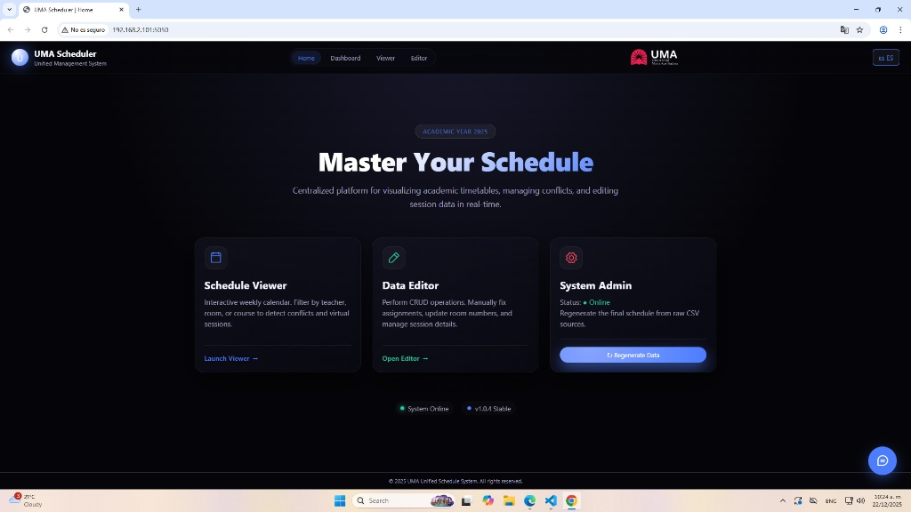
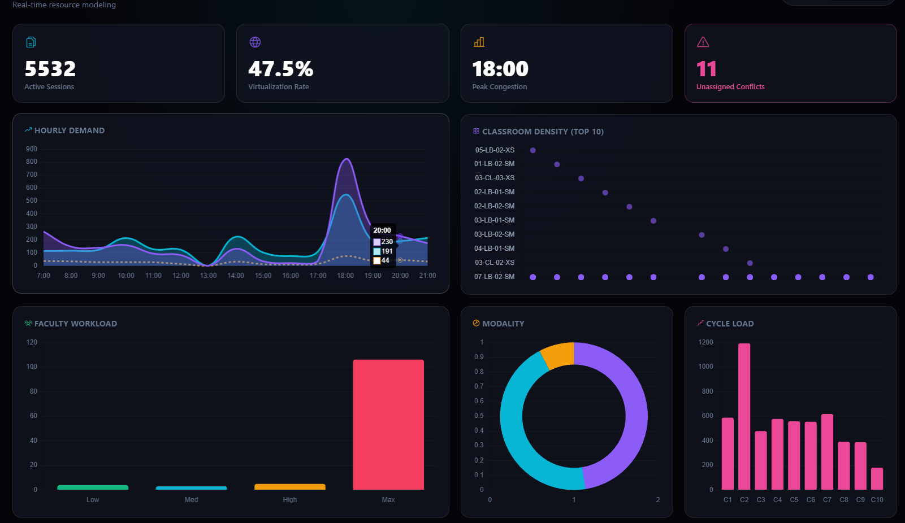
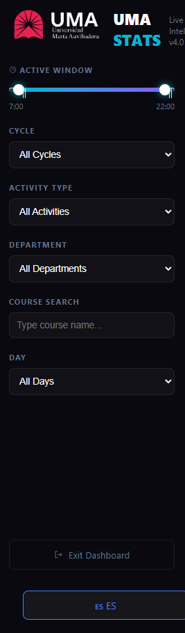
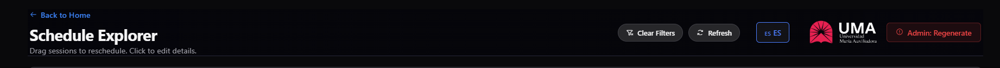
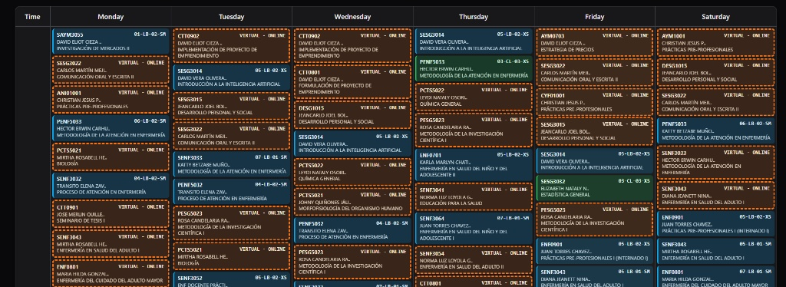
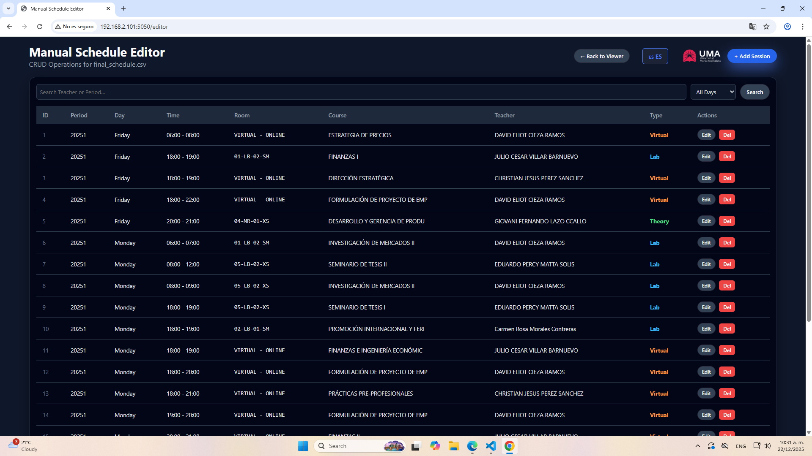
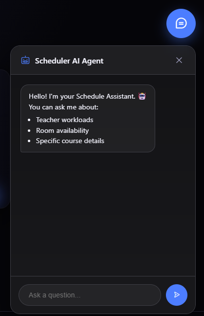
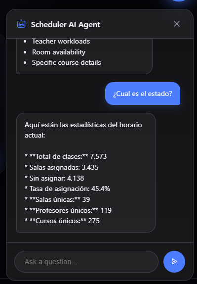

# 📘 User Manual: UMA Scheduler & AI Assistant

Welcome to the **UMA Scheduler**! This platform acts as a centralized hub for visualizing academic timetables, managing conflicts, and editing session data in real-time.

---

## 1. The Dashboard (Home)
Upon launching the application, you are greeted by the "Master Your Schedule" control center. This page acts as the central hub for all scheduling operations.

*Figure 1: The UMA Scheduler Home Page.*

### Key Sections:
The dashboard is divided into three main operational cards:
1.  **Schedule Viewer:**
    * *Status:* Interactive weekly calendar.
    * *Action:* Click **"Launch Viewer"** to filter by teacher, room, or course.
2.  **Data Editor:**
    * *Status:* CRUD (Create, Read, Update, Delete) operations.
    * *Action:* Click **"Open Editor"** to manually fix assignments.
3.  **System Admin:**
    * *Status:* Shows if the system is **Online** or Offline.
    * *Action:* Click the blue **"Regenerate Data"** button to run the AI engine.

---

## 2. Operational Dashboard (Analytics)
Access real-time resource modeling and health checks for your university schedule. This page provides a high-level view of demand, conflicts, and resource utilization.

### Key Metrics
The top banner provides immediate insight into the system's status:
* **Active Sessions:** Total classes currently scheduled.
* **Peak Congestion:** The time of day with the highest demand.
* **Unassigned Conflicts:** Critical alerts for classes that failed to find a slot.

*Figure 2a: Live operational status indicating system latency.*

### Visualizations & Filtering
The main panel breaks down data into **Hourly Demand**, **Classroom Density**, and **Faculty Workload** charts. You can use the sidebar to filter these metrics by Cycle, Activity Type, Department,Courses or Days.

*Figure 2b: Comprehensive charts showing faculty workload and hourly demand.*

### Sidebar Filters
You can use the sidebar to filter the metrics above by **Cycle**, **Activity Type**, **Department**, **Courses**, or **Days**.

*Figure 2c: The filtering sidebar for precise data analysis.*
---

## 3. The Schedule Explorer (Viewer)
The **Viewer** is the primary workspace for visualizing the timetable. It offers a "Drag-and-Drop" interface to modify class times and rooms instantly.

### Navigation & Actions
The top bar contains high-level controls. Use the **Admin: Regenerate** button only if you wish to rebuild the schedule from scratch using the AI engine.

*Figure 3a: The Explorer navigation bar.*

### The Weekly Grid
The main view displays a 6-day academic week.
* **Session Cards:** Each block represents a class (e.g., *SAYM3055*).
* **Color Legend:**
    * 🟦 **Lab:** Physical laboratory sessions.
    * 🟩 **Theory:** Standard classroom lectures.
    * 🟧 **Virtual:** Online/Remote sessions.
    * 🟥 **Conflict:** Sessions with overlap errors.

*Figure 3b: The interactive timetable grid.*

---

## 4. Manual Data Editor
For granular control over the schedule database, use the **Manual Schedule Editor**.

### Session Management
* **+ Add Session:** Opens a form to create a brand new class from scratch.
* **Search Bar:** Quickly locate a specific class by Teacher or Period.
* **Actions:** Use the **Edit** and **Del** buttons to modify or remove specific rows from the CSV database.

*Figure 4: The searchable data grid showing all active sessions.*

---

## 5. Scheduler AI Agent
The **Scheduler AI Agent** is an intelligent assistant integrated directly into the platform.

### How to Access
Click the **Blue Chat Bubble** in the bottom-right corner. The agent can answer questions regarding **Teacher Workloads**, **Room Availability**, and **Course Details**.

*Figure 5a: The AI Agent welcome screen.*

### Example Interaction
The agent understands context (in English or Spanish) and can retrieve real-time system statistics.

*Figure 5b: The Agent providing a live statistical breakdown of the schedule.*
