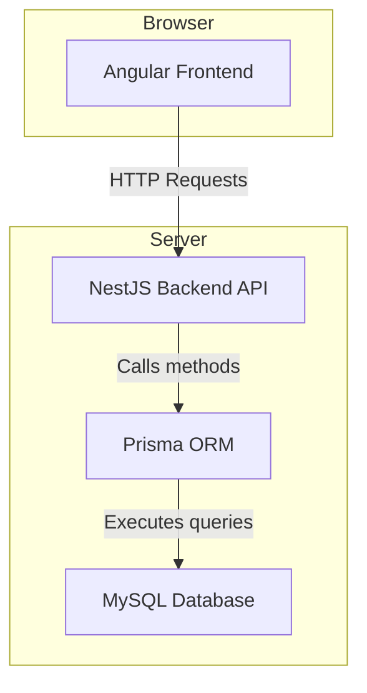
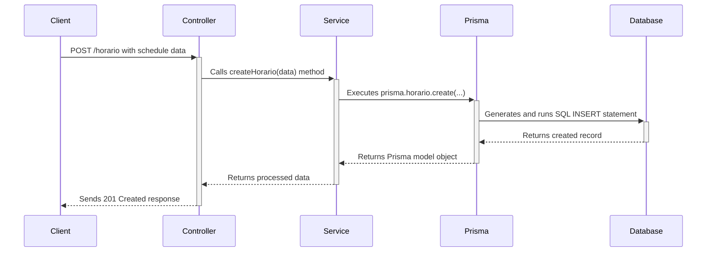
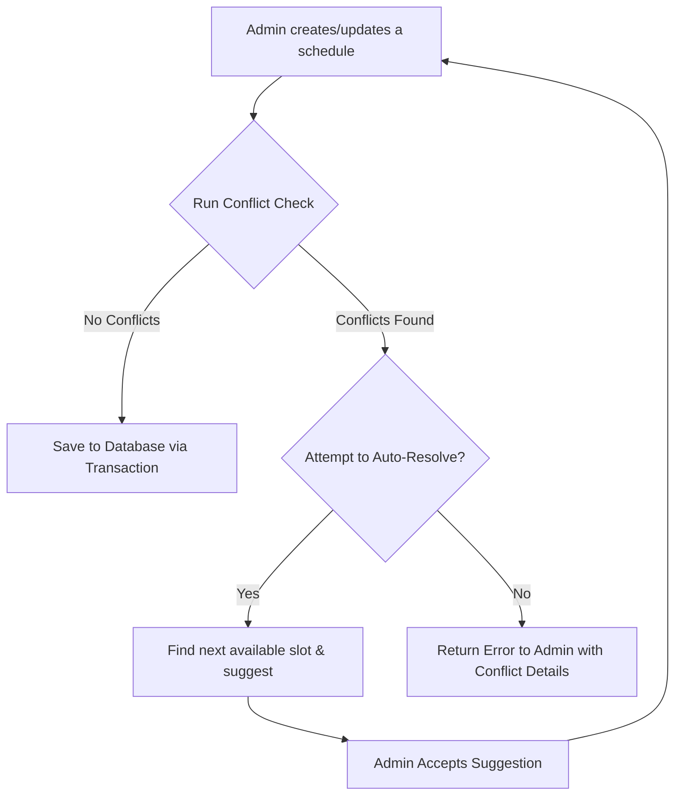

# internship_schduling_project
# this db_unique values are done when we thought to make some schduling realted project
---

# Project Documentation: Teacher & Schedule Management System

## 1. Project Overview

This project is a comprehensive management system designed to handle the complex scheduling of teachers, courses, and classrooms for an educational institution. It consists of a modern web frontend for user interaction and a robust backend to manage all business logic and data persistence.

### Core Challenge
The primary challenge is to manage and assign schedules while preventing conflicts, such as a single teacher or classroom being booked for multiple courses at the same time. The system must also consider teacher workload, availability, and other institutional constraints.

### AI/ML Integration Goal
The next phase of this project is to integrate intelligent features to automate and optimize the scheduling process. The goal is to move from manual conflict resolution to a system that can:
*   **Automatically prevent scheduling conflicts.**
*   **Suggest optimal schedules** based on predefined rules and historical data.
*   **Balance teacher workloads** fairly.
*   **Provide a "one-click" assignment feature** that intelligently populates the schedule.

---

## 2. System Architecture

The application is built on a modern, decoupled architecture with a clear separation between the frontend and backend.

*   **Backend (`nest_docente/`)**: A NestJS (Node.js) application that serves a REST API.
*   **Frontend (`Gestion_Docentes_New-main/`)**: An Angular single-page application (SPA).
*   **Database**: A MySQL database (`db_horarios_dev`) managed by the Prisma ORM.

### Architecture Diagram

---

## 3. Backend Deep Dive (`nest_docente/`)

The backend is built with NestJS, a framework that enforces a structured, modular architecture.

### Key Directories & Files
*   `prisma/schema.prisma`: **The single source of truth for the database schema.** This file defines all models (tables), fields, and relationships.
*   `src/modules/`: The application is divided into feature modules (e.g., `horario`, `docente`, `aula`). This keeps the code organized and scalable.
*   `src/modules/[feature]/[feature].controller.ts`: Defines the API endpoints for a feature. It handles incoming HTTP requests and delegates logic to the service. For example, `horario.controller.ts` defines endpoints like `POST /horario` and `GET /horario/turno/:turno_id`.
*   `src/modules/[feature]/[feature].service.ts`: Contains the core business logic. It interacts with the database via the Prisma Client and performs all data transformations and calculations. For example, `horario.service.ts` is responsible for creating, updating, and fetching schedule records.

### Request Lifecycle (Data Flow)

When the frontend sends a request to create a schedule, the data flows through the backend as follows:

---

## 4. Database Schema Breakdown

The database structure is the foundation of the scheduling logic. The core models involved in scheduling are:

*   **`Horario` (Schedule)**: This is the central table. Each row represents a single scheduled class, linking a teacher, a classroom, a course, and a time slot.
*   **`Docente` (Teacher)**: Contains information about each teacher, including their total assigned hours (`h_total`) and maximum allowed hours (`h_max`).
*   **`Aula` (Classroom)**: Represents a physical or virtual room, including its capacity and location.
*   **`Curso` (Course)**: The subjects or classes that need to be scheduled.
*   **`Turno` (Shift/Period)**: Represents an academic period (e.g., "Morning Shift," "Term 1"), helping group and filter schedules.

### Critical Relationships for Conflict Detection

Conflicts are detected by checking for unique combinations of the following foreign keys in the `Horario` table at overlapping times:
1.  **Teacher Availability**: `docente_id` + `dia` + `h_inicio` / `h_fin`
2.  **Classroom Availability**: `aula_id` + `dia` + `h_inicio` / `h_fin`

---

## 5. AI/ML Integration Strategy

The integration will be implemented in two main phases, starting with a solid rule-based foundation and later enhancing it with machine learning.

### Phase 1: Rule-Based Scheduling Engine (The Foundation)

This phase focuses on creating a deterministic system that strictly enforces the core scheduling rules.

#### **Hard Constraints (Must-Not-Violate Rules)**
These rules will be checked before any schedule is saved to the database.
1.  **Teacher Conflict**: A teacher (`docente_id`) cannot be assigned to more than one `Horario` if their time slots (`dia`, `h_inicio`, `h_fin`) overlap.
2.  **Classroom Conflict**: A classroom (`aula_id`) cannot be booked for more than one `Horario` if the time slots overlap.
3.  **Resource Conflict**: Specialized resources (like labs) linked to an `Aula` cannot be double-booked.

#### **Soft Constraints (Optimization Goals)**
These are treated as suggestions or secondary objectives.
1.  **Teacher Workload**: The system should warn or prevent assignments that push a teacher's `h_total` over their defined `h_max`.
2.  **Balanced Schedule**: The engine can suggest schedules that avoid putting too many classes back-to-back for a teacher, ensuring breaks.

#### **Implementation Plan**
*   **Create a new `ScheduleOptimizerService`**: This service will contain all the logic for conflict detection and validation.
*   **Integrate into `horario.service.ts`**: The existing `create` and `update` methods in `horario.service.ts` will call the `ScheduleOptimizerService` *before* committing any data.
*   **Use Database Transactions (`prisma.$transaction`)**: All schedule creation/updates and their validation checks must be wrapped in a transaction. This ensures that if a conflict is found, the entire operation is rolled back, leaving the database in a consistent state.

### Conflict Resolution Workflow

### Phase 2: ML-Assisted Features (The Enhancement)

Once the rule-based engine is stable, Machine Learning can be introduced to provide smarter, data-driven suggestions.

*   **What it does**: Analyzes historical scheduling data (`Horario`), attendance records (`Asistencia`), and teacher adjustments to learn patterns.
*   **Potential Features**:
    *   **Optimal Slot Suggestion**: Recommend the best time slot for a new course based on historical student attendance and teacher preferences.
    *   **Workload Fairness Prediction**: Identify teachers who are at risk of being overworked based on past patterns and suggest reassignments.
    *   **Automated Rescheduling**: If a teacher calls in sick, the model can suggest the most logical and least disruptive set of reassignments to cover their classes.

---

## 6. How to Get Started

### Prerequisites
*   Node.js
*   MySQL Server
*   An API client like Postman

### Backend Setup
1.  Navigate to the `nest_docente/` directory.
2.  Create a `.env` file and configure your `DATABASE_URL`.
3.  Install dependencies: `npm install`
4.  Run Prisma migrations to set up the database: `npx prisma migrate dev`
5.  Start the development server: `npm run start:dev`

### Frontend Setup
1.  Navigate to the `Gestion_Docentes_New-main/` directory.
2.  Install dependencies: `npm install`
3.  Start the development server: `ng serve`

### Key Areas to Explore
*   **To see all database models**: Open `nest_docente/prisma/schema.prisma`.
*   **To understand schedule APIs**: Explore `nest_docente/src/modules/horario/horario.controller.ts`.
*   **To see the core scheduling logic**: Read through `nest_docente/src/modules/horario/horario.service.ts`.
